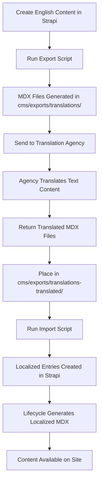
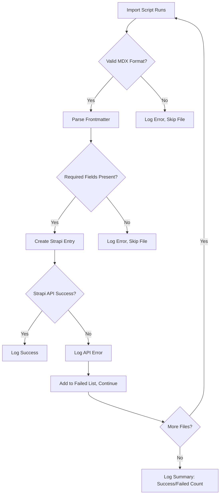

# Translation Management Implementation Report

## Overview

This report details the implementation of a translation management system for the Interledger.org site, migrating from Drupal's manual process to an automated Strapi + MDX workflow. The system supports multiple languages (Spanish, Chinese, German, French) with English as the default and fallback.

## Codebase Search Findings

**Existing Translation-Related Code:**

- `cms/types/generated/contentTypes.d.ts`: Contains i18n-related TypeScript types including `'plugin::i18n.locale'` (auto-generated, indicates Strapi's built-in i18n support)
- `src/content.config.ts`: Uses `i18nLoader` from Astro Starlight for documentation internationalization (unrelated to content translation)
- `cms/src/api/press-item/content-types/press-item/schema.json`: Has field-level i18n configuration with `"i18n": { "localized": false }` for content field (not enabled for translation)
- No existing translation scripts, workflows, or localized content found
- Blog posts have `lang` field but no i18n localization enabled

## Changes Made

### 1. Strapi Configuration

- **i18n Support**: Strapi v5 has built-in internationalization (no plugin installation required)
- **Locales**: Configure in Strapi admin (Settings → Internationalization) for en, es, zh, de, fr
- **Content Types**: Blog posts use `lang` field for locale identification (custom workflow, not Strapi's localized fields)

### 2. Export/Import Scripts

- **Export**: Queries Strapi API for English posts. Now supports selective export (skips locales that already have a translation in Strapi) and control via CLI arguments (`--limit`, `--since`, `--ids`, `--slugs`).
- **Import**: Parses translated MDX, extracts data. Now supports idempotent re-import via the `--force` flag, which updates existing entries using a `PUT` request instead of skipping them.
- **Bi-directional Linking**: Automatically maintains bi-directional relations between the English source and its translations in Strapi.
- **Error Handling**: Continues processing on failures, logs failed files at end.

## How It Works

### Content Generation

1. English content created in Strapi with `lang` empty or 'en'
2. Lifecycle hooks generate MDX: `date-slug.mdx` (English) or `date-slug.es.mdx` (localized)
3. MDX stored in `src/content/blog/`
4. Astro content collections load all files, filter by `lang` in pages/components

### Translation Handling

- Custom components in MDX: Agency translates text strings only, preserves JSX
- Tracking: Git diffs show changes between versions automatically

### API Integration

- Export: Fetches via Strapi REST API (`/api/blog-posts`)
- Import: POSTs to create localized entries
- Authentication: Uses `STRAPI_API_TOKEN` env var if needed

## Translation Workflow

### Step-by-Step Process



### Detailed Workflow

1. **Content Creation**:
   - Editor creates blog post in Strapi
   - Sets `lang` to empty (defaults to English)

2. **Export Phase**:
   - Run: `npm run translations:export` (optionally add `--limit`, `--since`, `--ids`, or `--slugs`)
   - Script fetches only English source posts (where `lang` is null or 'en')
   - Checks Strapi for existing translations; only generates MDX for missing locales
   - Generates MDX files with frontmatter and HTML-to-markdown converted content

3. **Agency Translation**:
   - Receive MDX files (e.g., `2024-01-01-my-post.es.mdx`)
   - Translate frontmatter fields: `title`, `description`, `ogImageUrl`
   - Translate body content (text, headers, component props)
   - Preserve all JSX, component names, and non-text elements

4. **Import Phase**:
   - Place translated files in `cms/exports/translations/`
   - Run: `npm run translations:import` (add `--force` to update existing entries)
   - Script parses each file, extracts data
   - Check for existing entry: skips by default, or updates if `--force` is provided
   - Creates/Updates Strapi entry with `lang='es'`, adjusted slug, and translated content
   - Verifies and maintains bi-directional links via the `linked_translations` relation
   - Strapi lifecycle generates `2024-01-01-my-post.es.mdx` in `src/content/blog/`

5. **Site Integration**:
   - Astro loads all MDX files via content collections
   - Pages filter posts by current language or fallback to English
   - Language switcher allows users to change locale

### Error Handling and Validation



### Benefits Over Drupal Process

- **Automation**: No manual field extraction/copy-paste
- **Reliability**: Structured MDX format vs. fragile Google Docs
- **Tracking**: Git provides automatic diff tracking
- **Efficiency**: Single file per post vs. multiple Drupal fields
- **Consistency**: MDX includes all metadata, images, SEO fields

### Technical Considerations

- **CLI Arguments**:

  **Export (`npm run translations:export -- [options]`)**:
  - `--limit <n>`: Process only the first N posts
  - `--since <YYYY-MM-DD>`: Process posts published after this date
  - `--ids <id1,id2>`: Process specific post IDs
  - `--slugs <s1,s2>`: Process specific slugs

  **Import (`npm run translations:import -- [options]`)**:
  - `--force`: Overwrite existing entries in Strapi instead of skipping them

  **Force Export Sync**:
  If you use `--force` with the export script, it will generate MDX files even for locales that already exist in Strapi. For these existing translations:
  - The content, title, and description will be pulled from the *translated* entry in Strapi, not the English source.
  - The MDX will have `isTranslated: true` by default.
  - This is useful for "pulling" current CMS state back into local files for editing or backup.

- **Environment Variables**:
  - `STRAPI_URL`: API endpoint (default: http://localhost:1337)
  - `STRAPI_API_TOKEN`: For authenticated requests
  - `BLOG_MDX_OUTPUT_PATH`: MDX output directory

- **File Structure**:

  ```
  cms/
  ├── scripts/
  │   ├── export-translations.ts
  │   └── import-translations.ts
  └── exports/
      └── translations/           # Both exported and incoming files
  src/content/blog/               # Generated localized MDX
  ```

- **Slug Handling**: Localized posts get suffix (e.g., `my-post-es`) to avoid conflicts

### Locale Fallback Ideas

- **Astro Level**: Filter posts by `lang` first, fall back to English if empty
- **Page Logic**: `const posts = await getCollection('blog'); const filtered = posts.filter(p => p.data.lang === currentLang || (!p.data.lang && currentLang === 'en'))`
- **Component Fallback**: If no posts in requested locale, show English with "Translation pending" notice
- **URL Handling**: `/es/blog/` shows Spanish posts, falls back to `/blog/` for English


