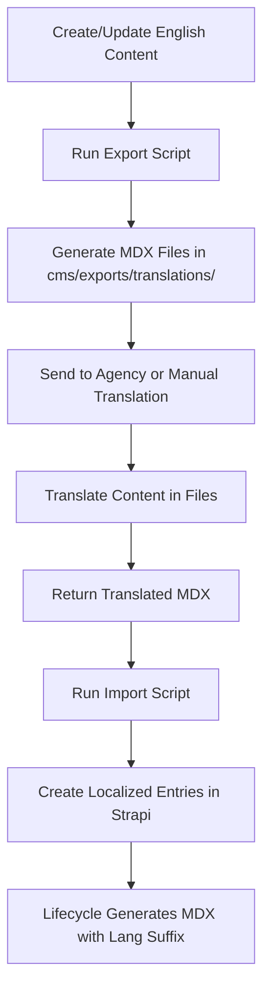
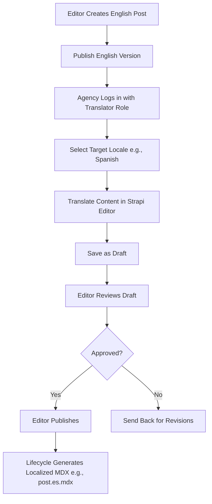
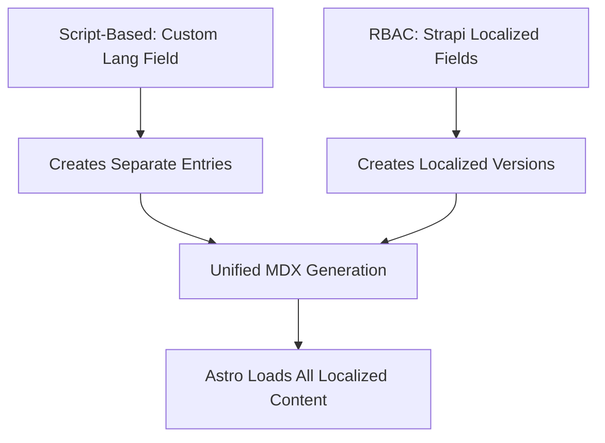

# Hybrid Translation Management: Script-Based + RBAC Flows

## Overview

This document outlines a hybrid translation management system that implements both script-based and RBAC (role-based access control) workflows working together. Both approaches will be fully functional and demonstrable to stakeholders, allowing the team to showcase flexibility in translation processes.

Script-based flow serves as the primary workflow matching the agency's external process, while RBAC provides an alternative in-Strapi translation method. Both coexist and can be used interchangeably.

## Codebase Search Findings

**Existing Translation-Related Code:**

- `cms/types/generated/contentTypes.d.ts`: Contains i18n-related TypeScript types including `'plugin::i18n.locale'` (auto-generated, indicates Strapi's built-in i18n support)
- `src/content.config.ts`: Uses `i18nLoader` from Astro Starlight for documentation internationalization (unrelated to content translation)
- `cms/src/api/press-item/content-types/press-item/schema.json`: Has field-level i18n configuration with `"i18n": { "localized": false }` for content field (not enabled for translation)
- No existing translation scripts, workflows, or localized content found
- Blog posts have `lang` field but no i18n localization enabled

**Conclusion**: Clean slate for translation implementation. Both flows can be built to coexist without conflicts.

## Script-Based Flow (Primary Workflow)

### When to Use

- Bulk/single translations from external agencies
- One-off manual updates
- Migration of existing translated content
- When agency prefers file-based workflow (current preference)

### Workflow

### Implementation

- Scripts to be created: `export-translations.js` and `import-translations.js`
- For bulk updates: Export all untranslated posts, translate externally, import
- For manual: Use for ad-hoc content fixes or agency fallbacks
- **Error Handling**: Continues processing on failures, logs failed files at end
- **Precedence**: Script imports take precedence (manual oversight handles overwrites)

## RBAC-Based Flow (In-Strapi Workflow)

### When to Use

- Agency comfortable with Strapi editor
- Real-time collaboration needed
- Small number of languages/posts
- Demonstrating alternative workflow options

### Setup

1. **Configure i18n in Strapi v5** (built-in, no plugin needed):
   - Settings → Internationalization → Add locales (es, zh, de, fr)
   - Content-type Builder → Enable localization for blog posts
   - Update blog schema: `"i18n": { "localized": true }`

2. **Role-Based Access Control**:
   - Create "Translator" role with Create/Update permissions for blog posts, no Publish permission
   - Create "Editor" role with Publish permissions for review

### Workflow

### Key Features

- **Native Integration**: Uses Strapi's built-in localization and draft system
- **Quality Control**: No direct publishing by agency
- **Real-time Collaboration**: Agency works in familiar editor
- **Version Control**: Strapi tracks changes per locale

## Coexistence and Integration

### How Both Flows Work Together

### Shared Infrastructure

- **Single Content Type**: Blog posts support both approaches
- **Unified Lifecycles**: Modified `generateFilename()` handles both lang field (scripts) and Strapi locales (RBAC)
- **Astro Integration**: Content collections load all MDX files regardless of creation method

### Switching Between Flows

- **Per Post**: Scripts for bulk, RBAC for ongoing
- **Per Language**: Scripts for complex languages, RBAC for similar ones
- **Demo Capability**: Both workflows can be demonstrated independently and together

### Data Consistency

- **Avoid Duplicates**: Scripts check for existing entries before importing
- **Conflict Resolution**: Scripts take precedence with manual oversight
- **Audit Trail**: Strapi admin shows creation method in entry history

## Implementation Steps

### Phase 1: Script-Based Setup

1. Create export/import scripts in `cms/scripts/`
2. Update blog post lifecycles to handle `lang` field
3. Test script workflow with sample content

### Phase 2: RBAC Setup

1. Configure locales in Strapi admin
2. Enable localization for blog content type
3. Create Translator and Editor roles
4. Test RBAC workflow separately

### Phase 3: Integration Testing

1. Test both workflows separately
2. Test combined usage scenarios
3. Prepare demo scenarios for stakeholders
4. Document workflow comparisons

### Phase 4: Demo Preparation

1. Create sample content demonstrating both flows
2. Prepare comparison slides showing pros/cons
3. Set up test environment with both workflows active
4. Train team on demonstrating both approaches

## Demo Scenarios for Stakeholders

### Scenario 1: Script-Based Workflow

- Show export process creating MDX files
- Demonstrate agency translation simulation
- Show import creating localized content
- Display generated localized MDX files

### Scenario 2: RBAC Workflow

- Create English content in Strapi
- Switch to Translator role
- Translate content in different locales
- Show draft/publish approval process

### Scenario 3: Hybrid Usage

- Use scripts for bulk import of existing translations
- Use RBAC for ongoing content updates
- Show both creating content in same collection
- Demonstrate seamless frontend display

## Benefits

- **Flexibility**: Two complete workflows for different use cases
- **Demonstrable**: Both approaches can be shown working
- **Efficiency**: Scripts for bulk operations, RBAC for ongoing translations
- **Quality**: Maintains review process regardless of method
- **Scalability**: Supports growth in translation volume
- **Migration Path**: Eases transition from external workflows

## Technical Considerations

- **Strapi Version**: v5 built-in i18n supports both approaches
- **API Access**: Scripts may need admin tokens for full CRUD operations
- **File Conflicts**: Scripts take precedence to avoid overwrites
- **Performance**: Monitor API load from script operations in production

This hybrid setup provides two fully functional translation workflows that can be demonstrated together, giving stakeholders complete visibility into translation process options.
