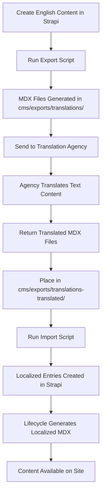
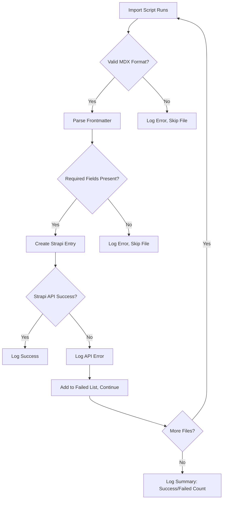

# Translation Management Implementation Report

## Overview

This report details the implementation of a translation management system for the Interledger.org site, migrating from Drupal's manual process to an automated Strapi + MDX workflow. The system supports multiple languages (Spanish, Chinese, German, French) with English as the default and fallback.

## Codebase Search Findings

**Existing Translation-Related Code:**

- `cms/types/generated/contentTypes.d.ts`: Contains i18n-related TypeScript types including `'plugin::i18n.locale'` (auto-generated, indicates Strapi's built-in i18n support)
- `src/content.config.ts`: Uses `i18nLoader` from Astro Starlight for documentation internationalization (unrelated to content translation)
- `cms/src/api/press-item/content-types/press-item/schema.json`: Has field-level i18n configuration with `"i18n": { "localized": false }` for content field (not enabled for translation)
- No existing translation scripts, workflows, or localized content found
- Blog posts have `lang` field but no i18n localization enabled

**Conclusion**: Clean slate for translation implementation. Can build new scripts and modify existing content types without conflicts.

## Changes Made

### 1. Strapi Configuration

- **i18n Support**: Strapi v5 has built-in internationalization (no plugin installation required)
- **Locales**: Configure in Strapi admin (Settings → Internationalization) for en, es, zh, de, fr
- **Content Types**: Blog posts use `lang` field for locale identification (custom workflow, not Strapi's localized fields)

### 2. Code Changes to be made

- `cms/src/api/blog-post/content-types/blog-post/lifecycles.ts`: Updated `generateFilename()` to append language suffix (e.g., `.es.mdx` for Spanish)
- `cms/scripts/export-translations.js`: New script to export English MDX files for agency
- `cms/scripts/import-translations.js`: New script to import translated MDX and create localized Strapi entries

#### Unchanged Files:

- `cms/package.json`: No i18n plugin added (built-in to Strapi v5)
- `src/content.config.ts`: Blog collection schema already includes optional `lang` field

### 3. Export/Import Scripts

- **Export**: Queries Strapi API for English posts, generates MDX files with frontmatter and content
- **Import**: Parses translated MDX, extracts data, creates new Strapi entries with `lang` set
- **Error Handling**: Continues processing on failures, logs failed files at end

## How It Works

### Content Generation

1. English content created in Strapi with `lang` empty or 'en'
2. Lifecycle hooks generate MDX: `date-slug.mdx` (English) or `date-slug.es.mdx` (localized)
3. MDX stored in `src/content/blog/`
4. Astro content collections load all files, filter by `lang` in pages/components

### Translation Handling

- Custom components in MDX: Agency translates text strings only, preserves JSX
- Fallback: Pages show English if translation missing
- Tracking: Git diffs show changes between versions automatically

### API Integration

- Export: Fetches via Strapi REST API (`/api/blog-posts`)
- Import: POSTs to create localized entries
- Authentication: Uses `STRAPI_API_TOKEN` env var if needed

## Translation Workflow

### Step-by-Step Process



### Detailed Workflow

1. **Content Creation**:
   - Editor creates blog post in Strapi
   - Sets `lang` to empty (defaults to English)

2. **Export Phase**:
   - Run: `node cms/scripts/export-translations.js`
   - Script fetches all English posts (where `lang` is null or 'en')
   - Generates MDX files with frontmatter and HTML-to-markdown converted content

3. **Agency Translation**:
   - Receive MDX files (e.g., `2024-01-01-my-post.mdx`)
   - Translate frontmatter fields: `title`, `description`, `ogImageUrl`
   - Translate body content (text, headers, component props)
   - Preserve all JSX, component names, and non-text elements
   - Save as `2024-01-01-my-post.es.mdx` (append language code)

4. **Import Phase**:
   - Place translated files in `cms/exports/translations-translated/`
   - Run: `node cms/scripts/import-translations.js`
   - Script parses each file, extracts data
   - Creates new Strapi entry with `lang='es'`, adjusted slug, and translated content
   - Strapi lifecycle generates `2024-01-01-my-post.es.mdx` in `src/content/blog/`

5. **Site Integration**:
   - Astro loads all MDX files via content collections
   - Pages filter posts by current language or fallback to English
   - Language switcher (to be implemented) allows users to change locale

### Error Handling and Validation



### Benefits Over Drupal Process

- **Automation**: No manual field extraction/copy-paste
- **Reliability**: Structured MDX format vs. fragile Google Docs
- **Tracking**: Git provides automatic diff tracking
- **Efficiency**: Single file per post vs. multiple Drupal fields
- **Consistency**: MDX includes all metadata, images, SEO fields

### Technical Considerations

- **Environment Variables**:
  - `STRAPI_URL`: API endpoint (default: http://localhost:1337)
  - `STRAPI_API_TOKEN`: For authenticated requests
  - `BLOG_MDX_OUTPUT_PATH`: MDX output directory

- **File Structure**:

  ```
  cms/
  ├── scripts/
  │   ├── export-translations.js
  │   └── import-translations.js
  └── exports/
      ├── translations/           # Exported English MDX
      └── translations-translated/ # Agency returns here
  src/content/blog/               # Generated localized MDX
  ```

- **Slug Handling**: Localized posts get suffix (e.g., `my-post-es`) to avoid conflicts

### Locale Fallback Ideas

- **Astro Level**: Filter posts by `lang` first, fall back to English if empty
- **Page Logic**: `const posts = await getCollection('blog'); const filtered = posts.filter(p => p.data.lang === currentLang || (!p.data.lang && currentLang === 'en'))`
- **Component Fallback**: If no posts in requested locale, show English with "Translation pending" notice
- **URL Handling**: `/es/blog/` shows Spanish posts, falls back to `/blog/` for English

### Next Steps

1. Configure locales in Strapi admin
2. Implement language switcher component
3. Test with sample content
4. Document for agency (translation guidelines)
5. Add validation for MDX parsing
6. Consider AI-assisted translation for future enhancement

This implementation provides a robust, scalable translation system that eliminates the pain points of the previous Drupal workflow while leveraging the power of MDX and Strapi.
